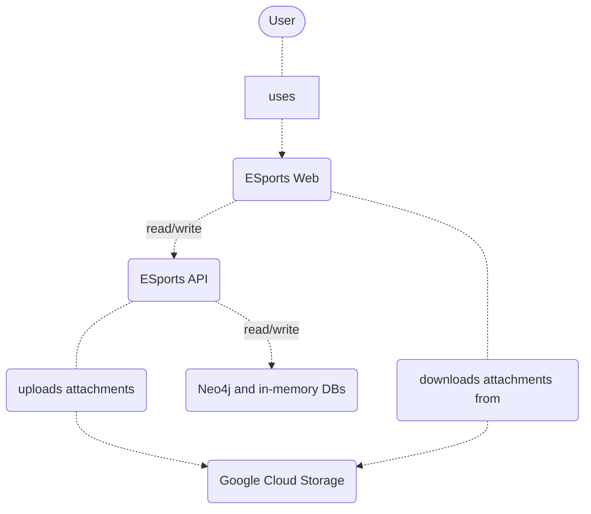
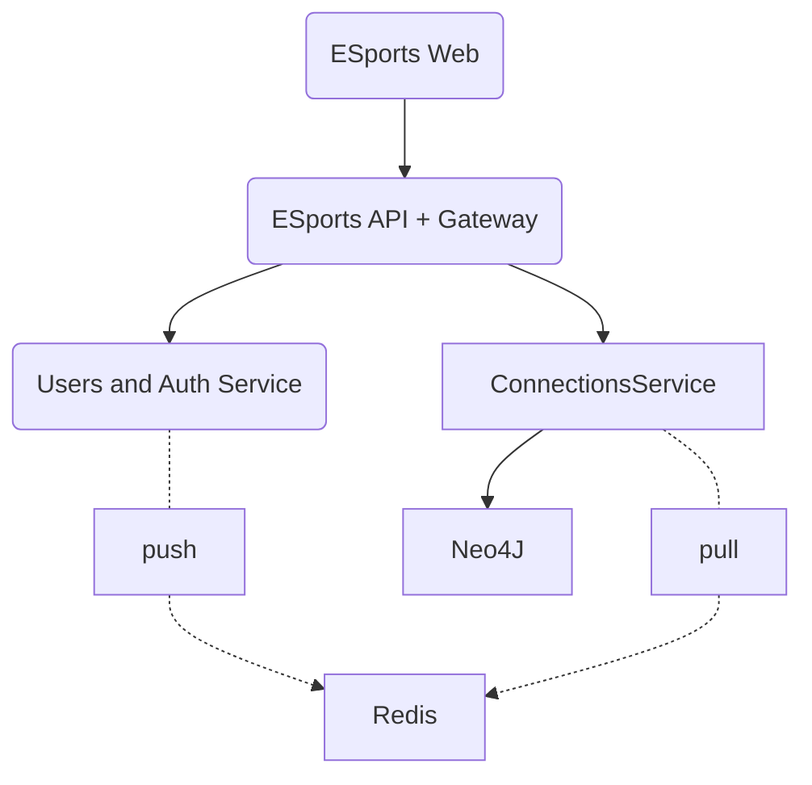
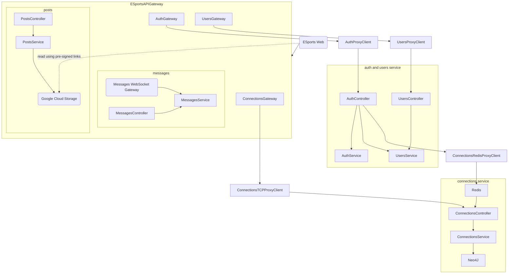

# ESports Platform

## Platform description

The system represents a platform where gamers can connect and chat with other gamers and post their latest thoughts or achievements.

## Use cases

1. Users can sign up on the platform
2. Users can log in on the platform
3. Users can create posts
    1. Users can optionally attach a picture to the post
    2. The picture can be removed from the post
4. Users will see a feed of what other users have posted
5. Users can connect with other users
    1. Users can see their own friends
    2. Users can see the friends of other users
    3. Users can send a friend request to people they are not yet connected
    4. Users can cancel friend requests they've sent
    5. Users can reject friends requests they've received
    6. Users can accept friend requests they've received
    7. Users can delete friends
6. Users can send messages to other users
7. Users can receive messages from other users

## Project setup

This project uses [Nx](https://nx.dev/) to manage the codebase.
Angular is used on the frontend, and NestJS on the backend.

The project can be started using Docker Compose, via `docker compose up`, which will make the platform available at `http://localhost:8080`.

Alternatively, the project can be started directly using the following commands:

```sh
nvm install
nvm use
npm ci
docker compose up -d redis neo4j
npm run start:all
```

## Diagrams

### System diagram



### Container diagram (of ESports Platform)



### Component diagram (of ESports Platform)


